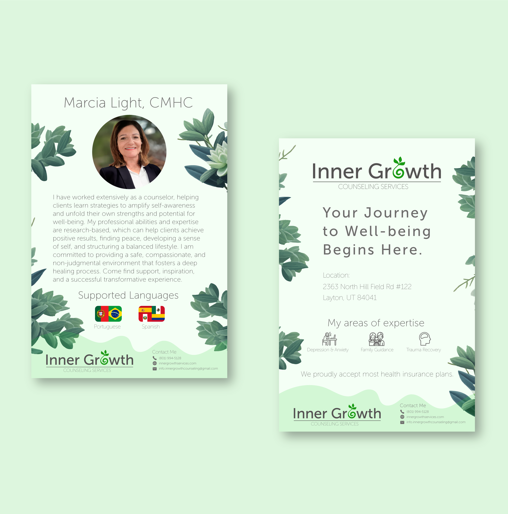

# Jaime Mendieta - Full Stack Web Developer and Freelancer

Hi! I'm Jaime, a Full Stack Web Developer and Freelancer at Weber State University, graduating in Dec 2023. I love crafting web apps, designing logos, and capturing stories through photography.

## About Me

I'm all about turning ideas into digital realities. Coding and design aren't just skills for me; they're passions that drive my creative process.

## What Am I Up To Now?

- Developing a webpage for Bonanza Counseling

## My Journey

**Education:**
- **Bachelor's Degree**: Weber State University, 2023
- **Associate's Degree**:  Weber State University, 2022

**Skills:**
- **Web Development**: Next.js, MongoDB, Express.js, React.js, Node.js, HTML, CSS, Sass
- **Design & Photography**:  Logos, web design, visual storytelling

## Projects
### Bonanza Counseling Services Website

Website Link: [Bonanza](https://www.bonanzacounseling.com)

* **Technology Stack:** Next.js, TypeScript, CSS
* **Project Overview:** Developed a professional, clean, and engaging website for Bonanza Counseling Services. This project was part of a contract assignment, focusing on creating a user-friendly platform that instills comfort and trust in clients.
* **Performance Focus:** Chose Next.js over React alone to enhance site performance, specifically targeting faster load speeds - a crucial factor for user retention and experience. Analytics and user feedback confirm the site's high speed and responsiveness.
* **Purpose and Functionality:** The website is strategically designed to attract and retain clients for Bonanza Counseling Services. It features a straightforward portal for client sign-ups and provides comprehensive information about the services offered, ensuring potential clients understand the value and quality of care they will receive.
* **Key Outcomes:** The project successfully delivers an optimized web experience, contributing to the company's client acquisition and engagement goals.

### Story Safe: Interactive Story Wiki with Spoiler Control

Website Link: [Story Safe Wiki](https://www.story-safe-wiki.com)

GitHub Repo: [Story Safe Repo](https://github.com/Story-Safe/story-safe-wiki)

* **Technology Stack:** React.js, MongoDB, Express.js, Node.js, JavaScript, HTML, CSS
* **Project Overview:** 'Story Safe' is an innovative wiki platform for story enthusiasts, developed as a Capstone group project. This unique site allows users to engage with story content without the risk of encountering spoilers.
* **Key Features:**
   * **Spoiler Tagging:** Users can tag spoilers within wiki pages, allowing others to control their exposure to plot details based on their current progress in the story.
   * **Custom Spoiler Levels:** Users can set their knowledge level of a story, enabling the site to dynamically blur text that exceeds their current level, ensuring a spoiler-free experience.
   * **User Contributions:** The platform empowers users to edit existing pages, add spoiler tags, and create new content, fostering a collaborative community.
   * **Search Functionality:** An efficient search feature enables users to easily find articles and stories within the database.
   * **User Accounts:** Account creation and login capabilities allow users to save their spoiler settings and preferences, enhancing the personalized experience.
* **Purpose and Impact:** 'Story Safe' addresses the common issue of unwanted spoilers in online story discussions, providing a safe space for readers and fans to explore and discuss stories at their own pace.

### Yelp Scraper to Simplified View

* **Course:** CS 3620 Server-Side Architecture (Final Project)
* **Technology Stack:** Selenium, Database Management, Web Development Technologies
* **Project Overview:** This project involved creating a tool that scrapes data from Yelp, a popular business review website, and then transforms and displays it in a simplified, user-friendly format on a custom web page.
* **Key Functions:**
   * **Data Scraping:** Utilized Selenium to effectively navigate and extract data from Yelp, a dynamic website known for its rich and complex content.
   * **Data Storage:** Implemented robust database management techniques to store the scraped data efficiently.
   * **Webpage Display:** Developed a webpage that presents the scraped Yelp data in an accessible and streamlined format, enhancing the user experience.
* **Purpose and Achievement:** The project demonstrates an innovative approach to data presentation, making complex information more digestible for users. It serves as an example of practical application of server-side architecture principles in a real-world context.

### Advertisement for Inner Growth Counseling

* **Tools Used:** Adobe XD, Adobe Illustrator, Adobe Photoshop
* **Project Overview:** This project showcases a blend of creative design and strategic communication to craft a compelling advertisement for Inner Growth Counseling. The focus was on creating an advertisement that not only catches the eye but also meaningfully connects with the intended audience.
* **Design and Creativity:** Leveraged the advanced features of Adobe XD, Illustrator, and Photoshop to create a visually appealing and emotionally resonant advertisement. The design process involved careful consideration of color schemes, typography, imagery, and layout to convey the core values and services of Inner Growth Counseling.
* **Communication Strategy:** Emphasized on delivering a clear, persuasive message that highlights the benefits and unique aspects of Inner Growth Counseling. The advertisement was tailored to appeal to potential clients seeking personal growth and mental well-being.
* **Objective and Impact:** The goal was to create an advertisement that not only stands out in a crowded market but also effectively communicates the compassionate and professional nature of Inner Growth Counseling’s services. This project demonstrates a harmonious fusion of artistic design and purposeful messaging in the realm of advertising.

## Connect With Me

Feel free to reach out via [email](jaimemendieta7@outlook.com) or on [LinkedIn](https://www.linkedin.com/in/jaimefmendieta/).
<!--
**jaimemendieta/jaimemendieta** is a ✨ _special_ ✨ repository because its `README.md` (this file) appears on your GitHub profile.
-->
